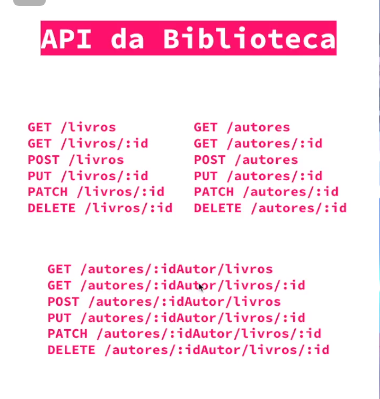

<<<<<<< HEAD
## Comandos:
npm init -y
.gitignore -> nodemodules
npm install expresss
npm install -D nodemon
package.json -> "scripts": "dev": "nodemon ./src/index.js"
pasta src -> index.js
npm run dev
src -> controladores -> rotas.js

=======
## Api
*** É um conjunto de instruções para comunicar com outra API ***

## REST Representational state transfer

"Conjunto de restrições de arquitetura que podem ser usadas para construção de API's"

## Organização de uma API REST

Coleção de recursos, os dados manipulados de uma API REST é chamado de recurso.

**Cada recurso possui um identificador,sendo único e imutável.**

## Json
É a representação de recurso de uma API

Coleção de recursos, ex: Coleção de livros pode ser organizada dentro da coleção de autores.

Em poucas palavras é uma notação, baseada em JS usada para transmitir dados na web.

{
  "logradouro": "avenida Henriqueto cardinali"
};

## Manipulação de coleção de recursos.

NUma requisição HTTP podemos definir métodos(verbos) para indicar a ação a ser realizada no recurso.

GET/livros
GET/livros/3 -> 3 é um recurso da coleção de livros, possui o identificador 3;

POST/livros -> serve para cadastrar um novo recurso dentro de uma coleção;

PUT/livros/12 -> alera por completo um recurso numa coleção;

PACH/livros/12 -> altera uma parte do recurso.

DELETE/livros/17 deleta o livro

***Não é obrigado a criar todas as rotas***

## Códigos de respostas HTTP

Em cada resposta temos um código para o status de requisição.

Status code:
# 2xx: Sucesso
>200: representa requisição bem sucedida
>201: created, requesição teve sucesso e algo foi criado.
>204: No Content, requisição bem sucedida
# 4xx: Erro do cliente
>400: Bad request, o servidor não entendeu a requisição pois está com uma sintaxe inválida.
>401: user sem altorização de autenticação
>403: Forbiden, não tem autorização 
>404: Not found, o servidor não encontra o recurso solicitado.
# 5xx: Erro interno no servidor
> O sevidor encontrou erro e não pode processar.

## Comandos usados 
npm init -y
.gitignore -> node_modules
npm install express
npm install -D nodemon 

"dev":"nodemon ./src/index.js"
criar pasta src
index.js
>>>>>>> 6c805c593b3e834647fb8bdcb0b1f3f3b92c4cc7
