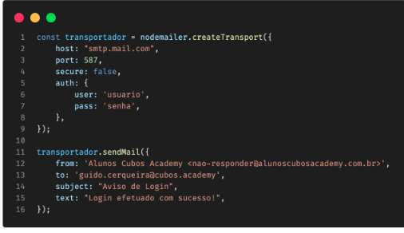

## Envio de e-mails ##
link da aula: https://docs.google.com/presentation/d/1fZ1LT5TIogPfK-XE0Bxsb_-kpa4KT_AOD1EC-aFNL8E/edit#slide=id.g13dcf223b90_0_10

 
-Devemos configurar um client com nossas ferramentas.
-Procolo SMTP - simple mail tranfer protocol.
-Para usa-lo devemos configurar um servidor que usa protocolo SMTP;

## Tipos usados ##
mailgun, mailjet, sendgrid e gmail.

Nodemailer é uma lib para node.js que possibilita o envio de e-mails.
Par isso é preciso usar servidor SMTP.

Exemplo:
 

